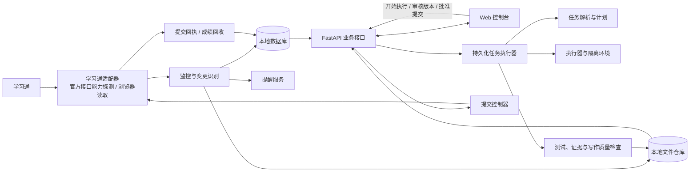

# 学习通学习助手：架构草案 v0.1

本草案依据“项目大纲与可行性探讨”对话整理。目标是把学习通上的课程任务转为可追踪的工作流：自动发现、归档、提醒；由用户决定是否开始执行；生成可核查的候选成果；由用户决定修改、重做或提交；提交后回收结果和成绩。

**实现状态（MVP 0.3）**：当前已落地的是本机学生测试版，使用 FastAPI + SQLite + 原生 HTML/CSS/JS。支持学习通与湖北第二师范学院教务官网两种登录入口，教务接入仅只读尝试课表和已发布成绩；两个平台的真实页面适配仍需学生账号验证。网页登录窗口必须在运行服务的用户桌面显示。自动提交、实验环境、后台定时任务和生产级 ToC 安全措施尚未实现。具体使用方式见 `PRODUCT_MANUAL.md`。下文涉及 Next.js、独立 worker 和提交控制的部分是后续路线，并非现有功能。

## 1. 产品边界与关键原则

- 先在一台 Windows 电脑上进行多学生账号隔离测试；对外服务前需设计每位学生独立的远程连接与安全部署方案。
- 发现任务后可自动读取任务信息和资料，但执行作业流程必须由用户点击“开始执行”。
- 任何提交都绑定用户审核时看过的交付版本。版本、目标任务或附件发生变化，批准立即失效。
- 页面、登录或提交结果不确定时停止自动操作并提示用户；不猜测成功，也不盲目重试。
- 作业成果保留证据来源：课程资料、用户输入、程序运行结果、引用和人工编辑记录。写作检查关注事实、引用和表达质量，不以“规避 AI 检测”为指标。
- 考试、限时测验等活动只做提醒和资料管理，不纳入自动答题或自动提交路径。

## 2. 总体结构



部署形态建议为**模块化单体**：一个 Python 后端代码库，API 进程与任务执行进程分开运行，前端独立构建。业务模块之间通过明确接口交互，但先不拆微服务。浏览器操作、长时间运行的实验和文件解析不放在 HTTP 请求内；FastAPI 文档也建议把较重的后台工作交给独立执行机制。

### 模块职责

| 模块 | 输入 | 输出与责任 |
| --- | --- | --- |
| `connector` | 用户已登录的会话、平台页面或已验证接口 | 课程、任务、附件、成绩的标准化快照；提交动作及回执 |
| `monitor` | 新快照、旧快照 | 新任务、截止时间变化、新附件、成绩变化等事件 |
| `archive` | 附件与课程资料 | 原文件、校验值、来源 URL、抓取时间和解析文本 |
| `workflow` | 用户启动命令、任务要求 | 可恢复的执行记录、步骤状态、失败原因 |
| `executor` | 执行计划、受控输入文件 | 代码、实验输出、图表、报告草稿及运行日志 |
| `quality` | 草稿、评分要求、证据 | 要求覆盖、测试、引用、无证据结论、附件完整性报告 |
| `submission` | 用户批准的交付版本 | 提交前检查、一次受控提交、平台回执与截图 |
| `notification` | 事件与截止时间 | 去重后的桌面或站内提醒 |
| `grades` | 平台成绩快照 | 作业成绩、课程汇总和变化记录 |

适配器对外只暴露 `list_courses`、`list_assignments`、`get_assignment`、`download_asset`、`get_grade`、`submit_deliverable` 等能力；每项能力单独标记为“已验证 / 不可用 / 待验证”。不能因为平台存在开放平台，就假定个人学生账号具备这些权限。浏览器实现优先使用可读标签和角色定位，集中维护页面选择器。Playwright 支持保存登录状态，但保存文件含敏感 Cookie，必须放在仓库外或受保护目录。[Playwright 登录状态说明](https://playwright.dev/python/docs/auth)、[定位器建议](https://playwright.dev/python/docs/locators)

## 3. 工作流与人工闸门

```text
DISCOVERED → ARCHIVED → AWAITING_START
                             │ 用户点击开始执行
                             ▼
                         PLANNING → RUNNING → VERIFYING
                                                   │
                                                   ▼
                                            AWAITING_REVIEW
                                             ├─ 打回：REWORK → RUNNING
                                             ├─ 手工编辑：生成新版本 → AWAITING_REVIEW
                                             └─ 批准当前版本：APPROVED
                                                                   │
                                                                   ▼
                                                            SUBMITTING
                                                             ├─ SUBMITTED
                                                             └─ NEEDS_ATTENTION
```

`GRADED` 不挤进上面的执行状态：成绩是提交后的独立记录，可能延迟公布或被老师修订。任务取消、登录失效、资料下载失败、截止时间变化也用独立事件记录。所有状态转换记录操作者、时间、旧状态、新状态和原因。

提交必须满足：任务目标仍相同、交付版本哈希与批准时一致、附件齐全、尚未确认提交成功、平台仍允许提交。发起提交前写入操作记录；若网页响应不清楚，先重新读取平台状态，确认后才决定下一步，避免重复提交。

## 4. 核心数据模型

| 实体 | 关键字段 |
| --- | --- |
| `Course` | 平台课程 ID、名称、教师、最近同步时间 |
| `Assignment` | 平台任务 ID、课程 ID、标题、类型、发布时间、截止时间、执行状态 |
| `AssignmentSnapshot` | 原始内容摘要、要求、评分规则、附件列表、抓取时间、内容哈希 |
| `Asset` | 文件路径、类型、大小、SHA-256、平台来源、解析状态 |
| `WorkflowRun` / `StepRun` | 启动者、执行版本、步骤、输入输出、日志、错误、重试次数 |
| `DeliverableVersion` | 草稿或最终文件、哈希、生成方式、父版本、创建时间 |
| `Evidence` | 结论或段落、所引用资料/实验输出、定位信息、核查结果 |
| `QualityReport` | 要求覆盖、测试结果、缺失附件、引用和事实问题、待人工确认项 |
| `Approval` | 用户、任务 ID、交付版本哈希、批准时间、有效状态 |
| `SubmissionAttempt` | 目标任务、版本哈希、时间、平台回执、截图、最终结果 |
| `GradeSnapshot` | 成绩、满分、评语、抓取时间 |
| `Notification` | 事件类型、去重键、计划时间、发送时间、状态 |

任务与附件以平台 ID 优先去重；没有可靠 ID 时用课程、标题、时间和内容哈希组合匹配，并标记可能冲突供用户确认。原始快照保留，解析结果可以重建。所有时间存储为 UTC，界面按 `Asia/Shanghai` 展示。

## 5. 技术选择

| 层 | V1 建议 | 扩展条件 |
| --- | --- | --- |
| 前端 | Next.js + TypeScript，任务看板、详情、审核页 | 首版交互明确后再补移动端适配 |
| API | FastAPI，集中实现权限闸门与状态转换 | 多用户需求出现后再抽独立服务 |
| 数据 | SQLite + 本地文件仓库，定期备份 | 多设备或高并发时迁移 PostgreSQL / 对象存储 |
| 平台接入 | 优先验证可用的正式接口；其余通过 Playwright 的可见页面流程 | 接口能力逐项替换浏览器实现 |
| 定时与长任务 | 独立 worker + 数据库任务记录；定时器只负责触发扫描和提醒 | 多机部署时再引入 Redis / 消息队列 |
| 文档检索 | 文件解析 + SQLite 全文索引，保留页码和段落来源 | 课程资料规模确实增长后再考虑向量检索 |
| 实验环境 | 任务专属工作目录，限制可读写路径和资源；按任务类型选择隔离运行方式 | 验证有需要时再引入容器化执行 |
| 通知 | 应用内通知 + Windows 桌面提醒 | 手机推送或邮件后续接入 |

MVP 不依赖“六个 Agent 同时自治”。先用确定性的状态机编排步骤，在资料解析、计划草拟和写作质量检查处调用模型；每个模型步骤的输入、输出、来源和失败原因都落盘。这样更容易定位错误，也能更换模型。

## 6. 前端页面

1. **总览**：今日新增、本周截止、等待开始、等待审核、提交异常、最近成绩。
2. **课程与任务列表**：课程过滤、截止时间排序、状态筛选、任务变更历史。
3. **任务详情**：原始要求、附件、评分规则、来源、计划、运行日志与风险提示；“开始执行”只在此明确触发。
4. **审核工作台**：成果预览、版本差异、证据定位、质量报告；支持批注、局部打回、人工编辑、批准当前版本。
5. **提交记录与成绩**：平台回执、提交截图、成绩和课程统计。
6. **设置**：登录会话状态、同步频率、提醒阈值、模型配置、文件存储位置。

## 7. 迭代顺序与验收点

### P0：平台接入验证

用本人账号手工登录；只读验证课程、作业、截止时间、附件和成绩能否稳定获取；记录验证码、页面跳转和账号失效场景。逐项验证官方接口权限，不在设计阶段预设可用。产出一张能力矩阵和匿名化页面样本。此阶段不自动提交。

### P1：任务中心 MVP

完成课程与作业同步、附件归档、变更检测、截止提醒、前端看板和本地备份。验收：同一任务重复扫描不会产生重复卡片；截止时间或附件变化能被发现；登录失效能通知用户；提醒不会对已提交任务反复发送。

### P2：执行与质量流程

实现“开始执行”闸门、任务计划、资料检索、实验工作目录、草稿版本、测试与证据链、审核工作台。先选一种真实任务类型做端到端闭环，例如 Python 编程实验。验收：未启动的任务不会执行；每条关键结论可定位到来源或标记为待核查；人工修改会生成新版本并使旧批准失效。

### P3：受控提交与成绩回收

仅针对已验证的普通作业类型，完成提交前检查、用户批准、单次提交、回执保存、异常人工处理、成绩同步。验收：没有匹配的批准记录无法提交；页面状态不明时不会再次提交；可从记录中还原提交了哪个版本、何时提交、平台返回了什么。

## 8. 现阶段需要确认的产品选择

- 首个试点任务类型：建议选**普通文件上传作业或 Python 编程实验**中的一个。
- V1 是否只在这台 Windows 电脑开机时运行；若要全天监控，需要一台常开的运行设备。
- 提醒渠道先用 Windows 桌面提醒是否足够。
- 正式接入前，须以自己的账号实际验证学校对应的学习通页面与课程类型。不同页面流程可能导致适配器实现差异。

下一步建议先做 P0 的只读验证，同时建立空的项目骨架和一组脱敏样本，随后根据能力矩阵细化接口与数据库迁移脚本。
